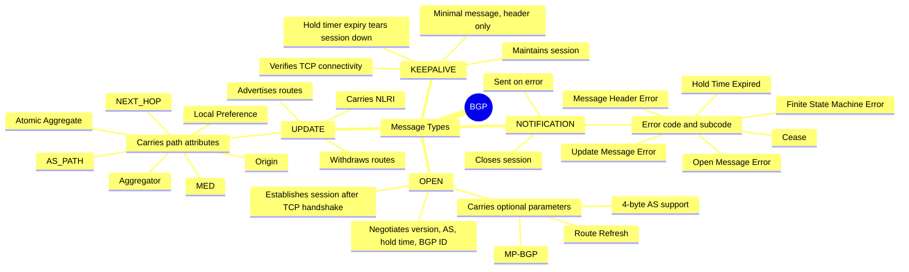

!
> BGP message types:

1.  ==Open==
           Help to establish bgp session once  3 way TCP handshake done.
           Open message help to decide session parameter (e / i bgp , KA etc. ) and contain information about bgp speaker.
     [[BGP_Hello.png]]
 -   **Optional Parameters** – contains a list of optional parameters as authentication, 
      
      > 										- multiprotocol support and route refresh. It includes
												    -   Support for MP-BGP (Multi-Protocol BGP).
												    -   Support for Route Refresh.
													- Support for 4-octet AS numbers.
2.  **==Keepalive==    : Periodic keepalives are used to verify TCP connectivity .IF miss 3 
						consecutive Hello session is torn down BGP session
 3   **==Update ==**  :          
		 Advertises feasible routes, withdrawn routes or both
		 Below attribute available in update : NA-MOLA-NA
        > origin
        > As path
        > Next hop
        > MED
        > LP
        >Atomic aggr
        > Agrregator
        > NLRI
          | Un feasible route len | Withdrwam routes | Total para len | Attribute | NLRI |
          | --------------------- | ---------------- | -------------- | --------- | ---- |
          |                       |                  |                |           |      |

4.  **==Notification==** : This message is sent whenever something bad has happened, e.g. an error is 
				detected and causes the BGP connection to close

| err code | err sub code | err data |
| -------- | ------------ | -------- |
|          |              |          |

        > **Message Header Error**
        > **Open Message Error**
        > **Update Message Error**
        > **Hold Time Expired**
        > **Finite State Machine Error**
        > **Cease**
        

